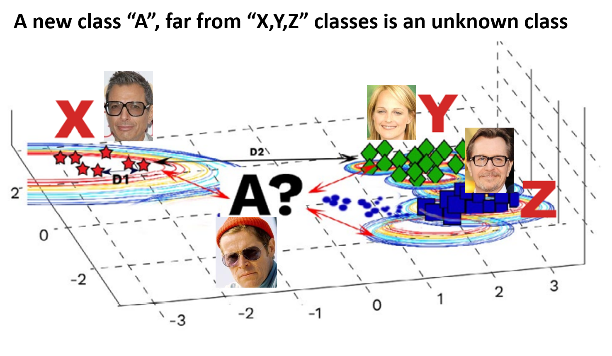

# Portfolio
---
## Natural Language Processing

### CS224n: Natural Language Processing with Deep Learning

My complete implementation of assignments and projects in [***CS224n: Natural Language Processing with Deep Learning***](http://web.stanford.edu/class/cs224n/) by Stanford (Winter, 2019).

**Neural Machine Translation:** An NMT system which translates texts from Spanish to English using a Bidirectional LSTM encoder for the source sentence and a Unidirectional LSTM Decoder with multiplicative attention for the target sentence ([GitHub](https://github.com/chriskhanhtran/CS224n-NLP-Solutions/tree/master/assignments/)).

**Dependency Parsing:** A Neural Transition-Based Dependency Parsing system with one-layer MLP ([GitHub](https://github.com/chriskhanhtran/CS224n-NLP-Assignments/tree/master/assignments/a3)).

---
### Detect Non-negative Airline Tweets: BERT for Sentiment Analysis

The release of Google's BERT is described as the beginning of a new era in NLP. In this notebook I'll use the HuggingFace's transformers library to fine-tune pretrained BERT model for a classification task. Then I will compare BERT's performance with a baseline model, in which I use a TF-IDF vectorizer and a Naive Bayes classifier. The transformers library helps us quickly and efficiently fine-tune the state-of-the-art BERT model and yield an accuracy rate 10% higher than the baseline model.

---
### Detect Food Trends from Facebook Posts: Co-occurence Matrix, Lift and PPMI

First I build co-occurence matrices of ingredients from Facebook posts from 2011 to 2015. Then, to identify interesting and rare ingredient combinations that occur more than by chance, I calculate Lift and PPMI metrics. Lastly, I plot time-series data of identified trends to validate my findings. Interesting food trends have emerged from this analysis.

 

 

---
### Detect Spam Messages: TF-IDF and Naive Bayes Classifier

In order to predict whether a message is spam, first I vectorized text messages into a format that machine learning algorithms can understand using Bag-of-Word and TF-IDF. Then I trained a machine learning model to learn to discriminate between normal and spam messages. Finally, with the trained model, I classified unlabel messages into normal or spam.

 

 

---
## Data Science

### Real time facial recognition system on Nvidia AGX Xavier 

A face recognition model developed and deployed on the Nvidia Jetson Xavier AGX board. The model can identify unknown and known faces with an average accuracy of 96% with well-known datasets like LFW and VGGFace2. The model is optimized using the TensorRT 
module, which improved the inference speed 10-15 times. The model performs well in one shot learning, handling 
variations like masks, spectacles, etc.

 

 

---
### Extreme value machine: An algorithm for openset classification

I performed comprehensive EDA to understand important variables, handled missing values, outliers, performed feature engineering, and ensembled machine learning models to predict house prices. My best model had Mean Absolute Error (MAE) of 12293.919, ranking <b>95/15502</b>, approximately <b>top 0.6%</b> in the Kaggle leaderboard.

 

 

---

### A patent on tube inspection using Artificial Intelligence

An inspection system for inspecting the internal surface of tubes was designed and developed. A light and efficient Convolutional Neural Network model was designed & trained to automatically identify and classify 5 different types of defects using bounding boxes. The CNN algorithm can identify defects of size ranging from 100 micron to a few millimeters. The algorithm was optimized to run on an edge device with at least 15 fps, making the inspection system work real time.

 

 

 

---

© 2020 Khanh Tran. Powered by Jekyll and the Minimal Theme.

