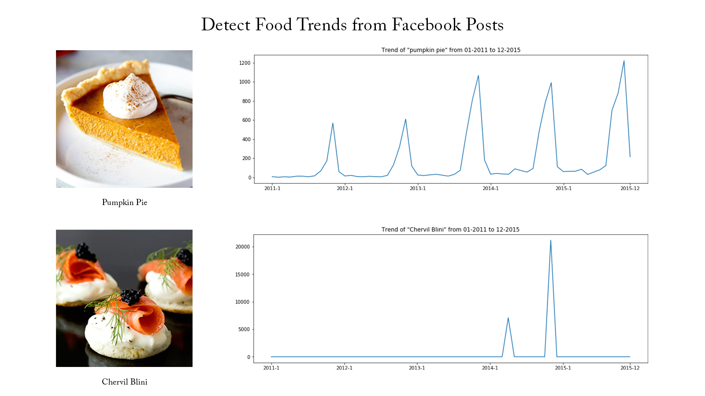

# Portfolio

## White papers

### Real time facial recognition system on Nvidia AGX Xavier 

A face recognition model developed and deployed on the Nvidia Jetson Xavier AGX board. The model can identify unknown and known faces with an average accuracy of 96% with well-known datasets like LFW and VGGFace2. The model is optimized using the TensorRT 
module, which improved the inference speed 10-15 times.

 

 

---
### Extreme value machine: An algorithm for openset classification

Extreme value machine (EVM) is a state of art algorithm for open set classification tasks. This algorithm is readily available in python, however implementations in other languages like C++ & Java are not handy. In this work we have developed an EVM algorithm using Java and integrated the algorithm in our android face recognition pipeline. This paper explains construction and working of the algorithm.

 

 

---
## Patents
### A tube inspection system using Artificial Intelligence

An inspection system for inspecting the internal surface of tubes was designed and developed. A light and efficient Convolutional Neural Network model was designed & trained to automatically identify and classify 5 different types of defects using bounding boxes. The CNN algorithm can identify defects of size ranging from 100 micron to a few millimeters. The algorithm was optimized to run on an edge device with at least 15 fps, making the inspection system work real time.

 

 

 

---
## Udacity course: Intel Edge AI

### Designing a people counter appilication

This is a simple project to count the number of people. In this project, people enter a room from one side, read a document and leave the room on the other side. An SSD people detector model was used to count the people with 100% accuracy. 

---
### AI for Smart Queue management

In this work, people standing in a queue are counted. The same SSD people detection model was used to count people inside a region of interest. If too many people are identified in a single queue, they are re-directed to the other queue.

---
### Gaze estimation algorithm

First I build co-occurence matrices of ingredients from Facebook posts from 2011 to 2015. Then, to identify interesting and rare ingredient combinations that occur more than by chance, I calculate Lift and PPMI metrics. Lastly, I plot time-series data of identified trends to validate my findings. Interesting food trends have emerged from this analysis.

 

 

---

---

© 2020 Khanh Tran. Powered by Jekyll and the Minimal Theme.

